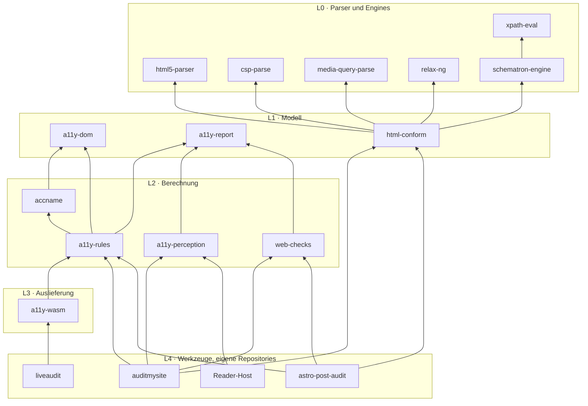

# Architektur

## Grundsatz

Dieses Repository enthält **Bibliotheken**, keine Werkzeuge. Jeder Host —
auditmysite, astro-post-audit, liveaudit, ein künftiger eigenständiger Prüfer —
lebt in seinem eigenen Repository und bindet die Pakete über crates.io bzw. npm
ein. Eine Bibliothek hier darf nie einen Host voraussetzen.

## Schichten

| Schicht | Aufgabe | Regel |
|---|---|---|
| L0 | Syntax lesen: HTML, CSP, Media Queries, XPath, RELAX NG, Schematron | keine Bewertung, keine Zugänglichkeitsbegriffe |
| L1 | Datenmodell: Baum, Befund, Konformanz | ein Befundmodell für alle Hosts (`a11y-report`) |
| L2 | Berechnung: Name, Regeln, Wahrnehmung, Prüfungen | reine Funktionen über L1, browserfrei |
| L3 | Auslieferung in andere Laufzeiten (WASM) | reicht durch, bewertet nicht |
| L4 | Erhebung, Orchestrierung, Ausgabe | außerhalb dieses Repositorys |

## Feste Regeln

1. **Abhängigkeiten nur nach unten.** Kein Paket importiert ein Paket derselben
   oder einer höheren Schicht. Kein Host im Repository.
2. **Browserfrei bis L3.** Kein `chromiumoxide`, keine CDP-Typen in einer
   öffentlichen API. Die Aufnahme im Browser bleibt Sache der Hosts; Pakete
   nehmen Daten entgegen, sie holen sie nicht.
3. **Intern `path` + `version`.** Interne Abhängigkeiten stehen mit beidem in
   `workspace.dependencies`, damit dasselbe Manifest lokal baut und
   veröffentlichbar bleibt. Hosts binden ausschließlich aus der Registry ein.
4. **Adapter bewerten nicht.** Was nur übersetzt (`a11y-wasm`), trifft keine
   Entscheidung über Befunde.
5. **Ein Feld gilt erst als vorhanden, wenn ein Lauf es gefüllt gesehen hat.**
   Teuer gelernt: zwei Felder eines Snapshots waren monatelang tot, ohne dass
   Tests oder Lesen es zeigten.

## Reihenfolge des Aufbaus

| Schritt | Paket | Woher | Zustand |
|---|---|---|---|
| 1 | `a11y-report`, `a11y-dom`, `accname`, `a11y-rules` | `casoon/a11y-core` | **importiert** (0.10.1), Historie mitgekommen |
| 2 | `html-conform` + `html5-parser`, `csp-parse`, `media-query-parse`, `xpath-eval`, `relax-ng`, `schematron-engine` | eigene Repositories | **importiert**, `=`-Pins aufgelöst |
| 3 | `a11y-wasm` | `casoon/liveaudit`, `packages/core` | **importiert**, Crate + npm-Paket `@casoon/a11y-wasm` |
| 4 | `a11y-perception` | `casoon/auditmysite` | **importiert** (0.1.0), browserfrei, 27 Tests |
| 5 | `web-checks` | Doppelungen aus auditmysite und astro-post-audit | noch nicht begonnen |

Jeder Schritt zieht die Historie des Ursprungs mit; die alten Repositories
werden danach archiviert, nicht gelöscht — veröffentlichte Pakete verweisen auf
sie.
