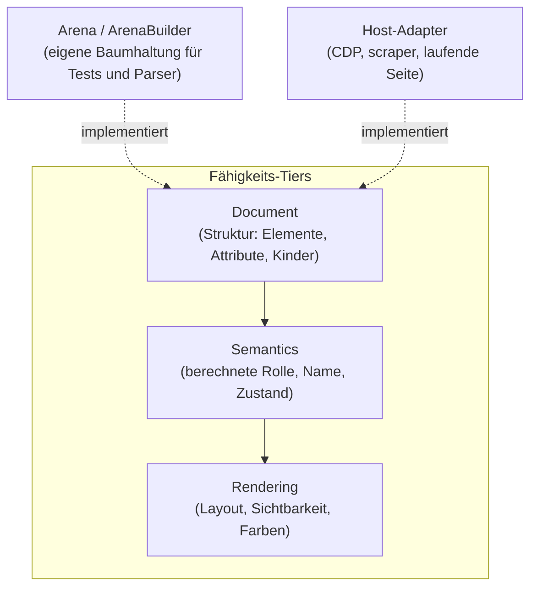

# a11y-dom

Die Abstraktion über das Dokument: ein DOM-förmiger Baum als Trait, plus
Fähigkeits-Tiers. Damit läuft dieselbe Regel über einen geparsten HTML-Baum,
über einen Browser-AX-Baum und über die laufende Seite.

## Stand

0.10.1 auf crates.io. Benutzt von `accname`, `a11y-rules` und allen Hosts;
auditmysite baut daraus in `dom_document.rs` einen Baum aus CDP-Daten.

## Aufbau

## Öffentliche Fläche

| Typ | Zweck |
|---|---|
| `Document` | das Minimum: Baum, Elemente, Attribute |
| `Semantics`, `Rendering` | Tiers, die ein Host nur dann anbietet, wenn er die Daten wirklich hat |
| `Arena`, `ArenaBuilder`, `ArenaNode` | fertige Implementierung für Tests und parserbasierte Hosts |

## Abhängigkeiten

Nach unten: nichts außer `serde` (optional). Nach oben: `accname`,
`a11y-rules`, Host-Adapter.

## Grenzen

Ein Tier ist eine Zusage über **Verfügbarkeit**, nicht über Qualität. Wer
`Rendering` anbietet, verspricht Layoutdaten — nicht, dass sie stimmen. Fehlt
ein Tier, liefern die darauf aufbauenden Regeln `NotRun`, nicht „bestanden".
