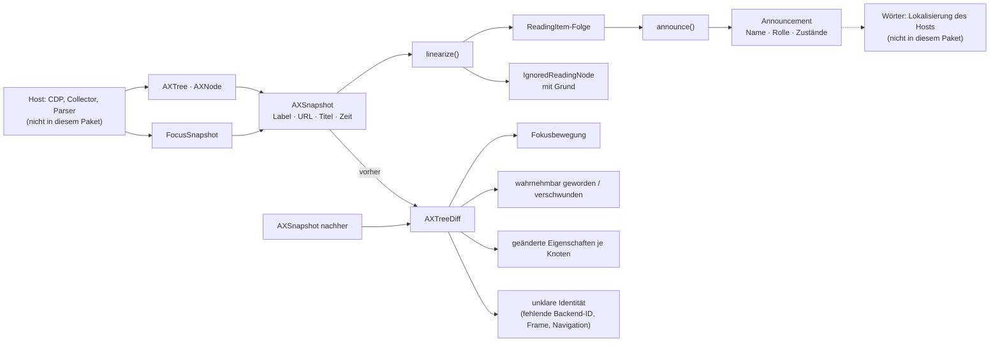

Was von einer Seite **wahrnehmbar** ist: eine Aufnahme, ihre Lesereihenfolge und
die Differenz zweier Aufnahmen. Das Paket berechnet, es erhebt nicht.

## Stand

0.2.0. Herausgezogen aus auditmysite
(`accessibility/{tree,diff,snapshot}.rs`, `screen_reader/{linearizer,types}.rs`)
nach dem Umbau, der an 133 Seiten mit 692 Journey-Instanzen gemessen wurde.
27 Tests sind mitgekommen und laufen ohne Browser.

Neu in 0.2.0 ist die **Ansage-Struktur** (`announce`). Der Renderer aus
auditmysites `announcer.rs` war daran nicht zu trennen, weil er Struktur und
Wörter in einem Zug erledigte: welche Teile eine Ansage hat, in welcher
Reihenfolge und welcher Zustand nichts hinzufügt — und gleich daneben, wie das
auf Deutsch heißt. Die erste Hälfte ist überall dieselbe und liegt jetzt hier;
die zweite bleibt beim Host, der seine Lokalisierung mitbringt.

## Aufbau

## Öffentliche Fläche

| Eintrag | Zweck |
|---|---|
| `AXTree`, `AXNode`, `AXValue`, `AXProperty` | der Baum und seine Knoten; `node_by_backend_id`, `is_within` für Zugehörigkeit |
| `AXSnapshot`, `FocusSnapshot`, `FocusIndicatorStatus`, `Rect` | ein aufgenommener Zeitpunkt samt Fokuslage |
| `AXTreeDiff` | die Differenz zweier Aufnahmen |
| `linearize`, `ReadingItem`, `IgnoredReadingNode` | die Projektion in Lesereihenfolge, mit dem, was sie übergeht |
| `announce`, `Announcement`, `AnnouncedRole`, `AnnouncedState` | woraus die Ansage zu einer Leseeinheit besteht — benannte Teile, keine Zeichenkette |

## Abhängigkeiten

Nach unten: nur `serde`. Nach oben: auditmysite; künftig der Reader-Host.
Bewusst **nicht** `a11y-report`: dieses Paket erzeugt keine Befunde.

## Grenzen

Drei Dinge, die die Messung gelehrt hat und die hier als Regel gelten:

1. **„Hinzugekommen" heißt wahrnehmbar geworden.** Chrome entfernt einen
   verborgenen Knoten nicht — er bleibt mit derselben Backend-ID als `ignored`
   mit Grund `notRendered` stehen. Über Anwesenheit definiert, sah der Diff die
   häufigste Art nicht, Inhalt zu öffnen.
2. **Identität über die Backend-ID, nicht über die Position.** Positionsvergleich
   über zwei Arrays war eine der drei Ursachen, warum 44 % der High-Befunde
   einer JavaScript-Sonde falsch waren.
3. **Unklare Identität wird gemeldet, nicht geraten.** Fehlende Backend-ID,
   Knotenersetzung, Frame-Wechsel, Navigation.

Und die Grenze des Verfahrens selbst: Der Diff belegt keine Ansage. Flüchtige
Änderungen zwischen zwei Aufnahmen braucht ein Host als Ereignisspur — im
Ursprungsprojekt ist das `interaction::live_regions`, und das ist Erhebung, also
nicht hier.
