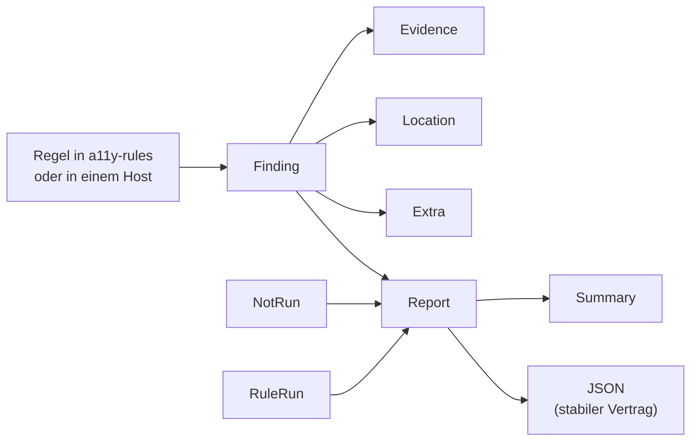

Das Befundmodell, das alle Werkzeuge teilen: vier Ergebniszustände, Severity,
WCAG-Zuordnung und ein stabiler JSON-Vertrag. Es bewertet nichts selbst.

## Stand

0.10.1 auf crates.io. Benutzt von auditmysite, astro-post-audit und liveaudit —
das erste Paket, das wirklich überall im Einsatz ist.

## Aufbau

## Öffentliche Fläche

| Typ | Zweck |
|---|---|
| `Outcome` | die vier Zustände; `NotRun` ist einer davon, nicht ein Sonderfall von „bestanden" |
| `Severity`, `WcagLevel` | Einordnung eines Befunds |
| `Finding`, `Evidence`, `Location` | ein Befund und woran er festgemacht ist |
| `Report`, `RuleRun`, `NotRun`, `Summary` | was ein Lauf ergeben hat, einschließlich der Regeln, die nicht liefen |
| `Extra` | hostspezifische Zusatzfelder, ohne den Vertrag zu brechen |

## Abhängigkeiten

Nach unten: nur `serde`. Nach oben: `a11y-rules`, `a11y-perception` (geplant),
alle Hosts.

## Grenzen

Das Modell sagt nichts darüber, wie ein Befund gefunden wurde und ob die
Messung tauglich war. Wer keine Belege mitliefert, bekommt einen Befund ohne
Belege — das Modell erzwingt sie nicht.
