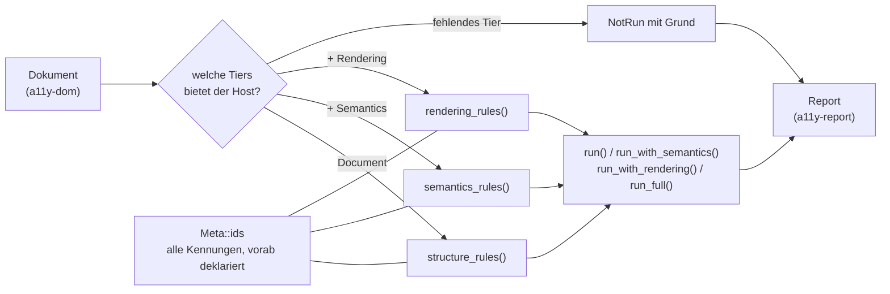

Der Regelbestand, generisch über `a11y-dom`: eine Implementierung für
Build-Zeit, CI und laufende Seite. Ergebnis ist immer ein `Report` aus
`a11y-report`.

## Stand

0.10.1 auf crates.io. Benutzt von auditmysite (`wcag/shared.rs` ruft
`run_with_semantics`), astro-post-audit und liveaudit. Die Kennungen sind über
alle Oberflächen stabil und in `Meta::ids` deklariert: 34 in Tier 1 (Struktur), 5 in Tier 2 (Semantik),
2 in Tier 3 (Darstellung).

## Aufbau

## Öffentliche Fläche

| Eintrag | Zweck |
|---|---|
| `run`, `run_with_semantics`, `run_with_rendering`, `run_full` | ein Lauf, je nach vorhandenen Tiers |
| `structure_rules`, `semantics_rules`, `rendering_rules` | die Regeln einzeln, wenn ein Host selbst orchestriert |
| `structure_metas`, `semantics_metas`, `rendering_metas` | alle Kennungen vorab, ohne zu laufen — für Abdeckungsberichte |
| `Meta`, `StructureRule`, `SemanticsRule`, `RenderingRule` | Regeltypen und ihre Deklaration |

## Abhängigkeiten

Nach unten: `a11y-dom`, `a11y-report`, `accname`. Nach oben: alle Hosts,
künftig `a11y-wasm`.

## Grenzen

Was ein Host nicht liefert, wird nicht geraten: fehlt ein Tier, entsteht
`NotRun` mit Grund. Die Regeln sind wortlautunabhängig — sie prüfen Struktur und
Semantik, nicht Textqualität. Und sie ersetzen keine manuelle Prüfung; welche
Kriterien überhaupt maschinell entscheidbar sind, steht in `docs/a11y/`.
