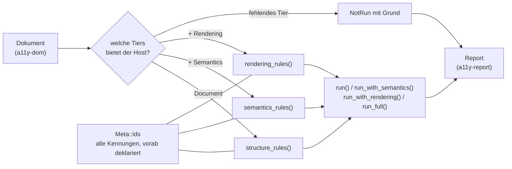

Der Regelbestand, generisch über `a11y-dom`: eine Implementierung für
Build-Zeit, CI und laufende Seite. Ergebnis ist immer ein `Report` aus
`a11y-report`.

## Stand

0.10.1 auf crates.io. Benutzt von auditmysite (`wcag/shared.rs` ruft
`run_with_semantics`), astro-post-audit und liveaudit. Die Kennungen sind über
alle Oberflächen stabil und in `Meta::ids` deklariert: 50 in Tier 1 (Struktur, davon 7 Checkliste), 16 in Tier 2 (Semantik),
10 in Tier 3 (Darstellung, davon 8 Heuristiken).

## Aufbau

```mermaid
flowchart LR
  doc["Dokument\n(a11y-dom)"] --> sel{"welche Tiers\nbietet der Host?"}
  sel -->|Document| t1["structure_rules()"]
  sel -->|+ Semantics| t2["semantics_rules()"]
  sel -->|+ Rendering| t3["rendering_rules()"]
  t1 & t2 & t3 --> run["run() / run_with_semantics()\nrun_with_rendering() / run_full()"]
  run --> rep["Report\n(a11y-report)"]
  meta["Meta::ids\nalle Kennungen, vorab deklariert"] --- t1 & t2 & t3
  sel -->|fehlendes Tier| nr["NotRun mit Grund"]
  nr --> rep
```

## Öffentliche Fläche

| Eintrag | Zweck |
|---|---|
| `run`, `run_with_semantics`, `run_with_rendering`, `run_full` | ein Lauf, je nach vorhandenen Tiers |
| `structure_rules`, `semantics_rules`, `rendering_rules` | die Regeln einzeln, wenn ein Host selbst orchestriert |
| `structure_metas`, `semantics_metas`, `rendering_metas` | alle Kennungen vorab, ohne zu laufen — für Abdeckungsberichte |
| `Meta`, `StructureRule`, `SemanticsRule`, `RenderingRule` | Regeltypen und ihre Deklaration |
| `Scope` | welche Knoten eine Regel sieht: Accessibility-Tree, Dargestelltes oder das ganze Markup |

Zwei Regelgruppen urteilen bewusst nicht: die **Checkliste** (`manual/*`,
`UNTESTED` je Seite und Kriterium, sobald es auf der Seite anwendbar ist) und
die **Heuristiken** in Tier 3 (`REVIEW`, aus `Rendering::layout` und
`bounds`; ohne diese Daten melden sie nichts, nur die ungemessene
Fokus-Sichtbarkeit bleibt als `UNTESTED` stehen).

## ARIA nach WAI-ARIA 1.2

Die `aria/*`-Regeln prüfen Attributnamen, Wertebereiche, erlaubte und
verbotene Attribute je Rolle sowie Kontext und Bestandteile. Die Tabellen dazu
sind aus der Spezifikation erzeugt (eine Bitmaske je Rolle). Kontext und
Bestandteile laufen über das DOM, nicht über den Accessibility-Tree: Ein `<li>`
in einer Liste mit fremder Rolle zählt als `listitem`, auch wo Chrome es
glättet (auditmysite#715). Native Tabellen und Listen ohne `role` prüfen die
`tables/*`- und `lists/*`-Regeln.

## Namen

Neben `links/`, `buttons/`, `svg/` und `tables/name-missing` prüfen
`dialog/name-missing`, `summary/name-missing` und `names/required-missing`
die Rollen, für die WAI-ARIA 1.2 einen Namen verlangt. `label-in-name/mismatch`
vergleicht nach WCAG 2.5.3 den Namen mit dem sichtbaren Text,
`status/live-overridden` die `aria-live`-Angabe von Live-Regionen mit der
Vorgabe ihrer Rolle.

## Abhängigkeiten

Nach unten: `a11y-dom`, `a11y-report`, `accname`. Nach oben: alle Hosts,
künftig `a11y-wasm`.

## Geltungsbereich

Jede Regel deklariert in `Meta::scope`, welche Knoten sie sieht, und läuft über
eine Sicht auf das Dokument, in der die übrigen fehlen:

| `Scope` | fehlt in der Sicht | Regeln |
|---|---|---|
| `AccessibilityTree` | `aria-hidden="true"`, nicht Dargestelltes | der Normalfall |
| `Rendered` | nicht Dargestelltes | `keyboard/*`, Kontrast |
| `Markup` | nichts | Dokumentweites, `aria/reference-missing`, `ids/duplicate`, `popover/*` |

„Nicht dargestellt" heißt mit Tier 3 `display: none` oder `visibility: hidden`,
ohne das `hidden`-Attribut. Ohne Stile bleibt per CSS Verstecktes in der Sicht
— die ehrliche Grenze des statischen Falls. `visibility` kann an einem
Nachfahren wieder `visible` sein; ein solcher Nachfahre fällt mit weg.

## Grenzen

Was ein Host nicht liefert, wird nicht geraten: fehlt ein Tier, entsteht
`NotRun` mit Grund. Die Regeln sind wortlautunabhängig — sie prüfen Struktur und
Semantik, nicht Textqualität. Und sie ersetzen keine manuelle Prüfung; welche
Kriterien überhaupt maschinell entscheidbar sind, steht in `docs/a11y/`.
