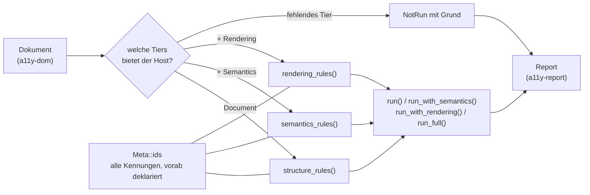

Der Regelbestand, generisch über `a11y-dom`: eine Implementierung für
Build-Zeit, CI und laufende Seite. Ergebnis ist immer ein `Report` aus
`a11y-report`.

## Stand

0.10.1 auf crates.io. Benutzt von auditmysite (`wcag/shared.rs` ruft
`run_with_semantics`), astro-post-audit und liveaudit. Die Kennungen sind über
alle Oberflächen stabil und in `Meta::ids` deklariert: 87 in Tier 1 (Struktur, davon 7 Checkliste und 7 Darstellungskonvention), 31 in Tier 2 (Semantik),
14 in Tier 3 (Darstellung, davon 8 Heuristiken), 5 über Stylesheets.

## Aufbau

```mermaid
flowchart LR
  doc["Dokument\n(a11y-dom)"] --> sel{"welche Tiers\nbietet der Host?"}
  sel -->|Document| t1["structure_rules()"]
  sel -->|+ Semantics| t2["semantics_rules()"]
  sel -->|+ Rendering| t3["rendering_rules()"]
  t1 & t2 & t3 --> run["run() / run_with_semantics()\nrun_with_rendering() / run_full()"]
  run --> rep["Report\n(a11y-report)"]
  meta["Meta::ids\nalle Kennungen, vorab deklariert"] --- t1 & t2 & t3
  sel -->|fehlendes Tier| nr["NotRun mit Grund"]
  nr --> rep
```

## Öffentliche Fläche

| Eintrag | Zweck |
|---|---|
| `run`, `run_with_semantics`, `run_with_rendering`, `run_full` | ein Lauf, je nach vorhandenen Tiers |
| `run_stylesheets` | ergänzt einen Bericht um die Regeln über Stylesheets (`stylesheet-parse`) |
| `structure_rules`, `semantics_rules`, `rendering_rules` | die Regeln einzeln, wenn ein Host selbst orchestriert |
| `structure_metas`, `semantics_metas`, `rendering_metas`, `stylesheet_metas` | alle Kennungen vorab, ohne zu laufen — für Abdeckungsberichte |
| `Meta`, `StructureRule`, `SemanticsRule`, `RenderingRule`, `StylesheetRule` | Regeltypen und ihre Deklaration |
| `Scope` | welche Knoten eine Regel sieht: Accessibility-Tree, Dargestelltes oder das ganze Markup |

Zwei Regelgruppen urteilen bewusst nicht: die **Checkliste** (`manual/*`,
`UNTESTED` je Seite und Kriterium, sobald es auf der Seite anwendbar ist) und
die **Heuristiken** in Tier 3 (`REVIEW`, aus `Rendering::layout` und
`bounds`; ohne diese Daten melden sie nichts, nur die ungemessene
Fokus-Sichtbarkeit bleibt als `UNTESTED` stehen).

## ARIA nach WAI-ARIA 1.2

Die `aria/*`-Regeln prüfen Attributnamen, Wertebereiche, erlaubte und
verbotene Attribute je Rolle sowie Kontext und Bestandteile. Die Tabellen dazu
sind aus der Spezifikation erzeugt (eine Bitmaske je Rolle). Kontext und
Bestandteile laufen über das DOM, nicht über den Accessibility-Tree: Ein `<li>`
in einer Liste mit fremder Rolle zählt als `listitem`, auch wo Chrome es
glättet (auditmysite#715). Native Tabellen und Listen ohne `role` prüfen die
`tables/*`- und `lists/*`-Regeln.

## Namen

Neben `links/`, `buttons/`, `svg/` und `tables/name-missing` prüfen
`dialog/name-missing`, `summary/name-missing` und `names/required-missing`
die Rollen, für die WAI-ARIA 1.2 einen Namen verlangt. `label-in-name/mismatch`
vergleicht nach WCAG 2.5.3 den Namen mit dem sichtbaren Text,
`status/live-overridden` die `aria-live`-Angabe von Live-Regionen mit der
Vorgabe ihrer Rolle.

## Formulare

`forms/*` prüft Beschriftung, Gruppen, Fehlerbeschreibung (`aria-invalid`),
Autofill-Angaben nach dem HTML-Standard, Absende-Elemente und wiederholte
Eingaben; `context/*` den Kontextwechsel bei Fokus und Eingabe (3.2.1,
3.2.2), `auth/captcha` ein Captcha im Anmeldeformular (3.3.8). Was nur aus
Wortlaut oder Handlern geraten werden kann — Zweck eines Felds, Formatvorgabe,
Pflichtkennzeichnung, Wiederholung, Captcha —, ist `REVIEW`. Der Einfüge-Test
an Passwortfeldern und das Lesen von Handlern über `window` bleiben im Host.

## Darstellungskonvention

`viz/*` und `display/*` prüfen die statische Hälfte der
[Darstellungskonvention](../a11y/concepts/darstellungsmodi.md) (Entwurf v0,
casoon/barrierlab#22): `figure[data-viz]` mit Text-, Standbild- und
Live-Schicht, `html[data-display]` mit Umschalter. Die Regeln stehen hier und
nicht in `web-checks`, weil sie den DOM brauchen; sie sind Tier 1. Sie melden
nur auf Seiten, die die Konvention benutzen, tragen das Schlagwort
`best-practice` und hängen am nächsten WCAG-Kriterium. Was erst die laufende
Seite zeigt — berechnete Sichtbarkeit, der Zeitpunkt von `data-display`, der
Textmodus —, misst auditmysite.

## Stylesheets

Fünf Regeln lesen die Stylesheets der Seite: `focus/outline-removed` (2.4.7),
`motion/reduced-motion-ignored` (2.3.3), `orientation/content-hidden` (1.3.4),
`text/justified` und `text/line-height-tight` (1.4.8). Der Host gibt den
CSS-Text jedes Sheets an `stylesheet_parse::parse_stylesheet` und den Bericht eines
`run_*` an `run_stylesheets`; ohne diesen Schritt stehen die fünf mit
`NotRun::CapabilityMissing` im Bericht. Woher der Text kommt, ist Sache des
Hosts: aus `document.styleSheets` im Browser oder aus den Dateien eines Builds.

Ob eine Regel auf dieser Seite gilt, entscheidet ein eigener Selektor-Abgleich
gegen das Dokument (Teilmenge von Selectors Level 4; Zustände und
Pseudo-Elemente gelten als erfüllt, Unbekanntes wie `:has()` als möglicher
Treffer). Keine Kaskade mit Spezifität: Für den Fließtext zählt die letzte
treffende Angabe am Absatz, sonst am nächsten Vorfahren.

## Abhängigkeiten

Nach unten: `a11y-dom`, `a11y-report`, `accname`, `stylesheet-parse`. Nach oben: alle Hosts,
künftig `a11y-wasm`.

## Geltungsbereich

Jede Regel deklariert in `Meta::scope`, welche Knoten sie sieht, und läuft über
eine Sicht auf das Dokument, in der die übrigen fehlen:

| `Scope` | fehlt in der Sicht | Regeln |
|---|---|---|
| `AccessibilityTree` | `aria-hidden="true"`, nicht Dargestelltes | der Normalfall |
| `Rendered` | nicht Dargestelltes | `keyboard/positive-tabindex`, `keyboard/hidden-focusable`, `keyboard/click-handler-not-focusable`, Kontrast |
| `Markup` | nichts | Dokumentweites, `aria/reference-missing`, `ids/duplicate`, `popover/*`, `tables/headers-attr-invalid`, `patterns/tooltip-unreferenced`, `viz/*` und `display/*` |

„Nicht dargestellt" heißt mit Tier 3 `display: none` oder `visibility: hidden`,
ohne das `hidden`-Attribut. Ohne Stile bleibt per CSS Verstecktes in der Sicht
— die ehrliche Grenze des statischen Falls. `visibility` kann an einem
Nachfahren wieder `visible` sein; ein solcher Nachfahre fällt mit weg.

## Grenzen

Was ein Host nicht liefert, wird nicht geraten: fehlt ein Tier, entsteht
`NotRun` mit Grund. Die Regeln sind wortlautunabhängig — sie prüfen Struktur und
Semantik, nicht Textqualität. Und sie ersetzen keine manuelle Prüfung; welche
Kriterien überhaupt maschinell entscheidbar sind, steht in `docs/a11y/`.
