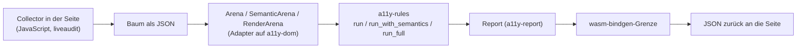

Der Regelbestand als WebAssembly: dieselben Regeln, die zur Build-Zeit und in CI
laufen, laufen damit **in der geöffneten Seite**. Das Paket übersetzt, es
bewertet nicht.

## Stand

0.1.0, neu in barrierlab — herausgezogen aus `liveaudit/packages/core`
(`liveaudit-core`, war `publish = false`). Crate auf crates.io, WASM-Artefakt als
npm-Paket `@casoon/a11y-wasm`. Erster Konsument ist liveaudit.

## Aufbau

Welche Regeln laufen, hängt daran, welche Spalten der Collector mitliefert: nur
Struktur, zusätzlich Semantik, zusätzlich Darstellung. Fehlt eine Schicht, fällt
die Regel auf `NotRun` — nicht auf „bestanden".

## Bauen

`wasm-pack` kennt kein `--profile` und würde mit `[profile.release]` bauen
(opt-level 3). Hier geht Größe vor Geschwindigkeit, deshalb baut
`packages/a11y-wasm/build.mjs` mit `[profile.wasm-release]` und ruft
`wasm-bindgen` selbst auf, danach `wasm-opt -Oz`.

Die CLI-Version von `wasm-bindgen` muss zur Crate-Version passen, sonst bricht
der Schritt mit einem Schema-Fehler ab.

## Öffentliche Fläche

`Arena`, `SemanticArena`, `RenderArena`, `RenderingColumns` und die
`wasm-bindgen`-Einsprünge für einen Scan. Rust-Konsumenten können das Crate auch
ohne WASM als `rlib` benutzen.

## Grenzen

Keine Erhebung: das Paket öffnet keine Seite und liest kein DOM. Wer den Baum
falsch einsammelt, bekommt falsche Befunde — die Verantwortung für Shadow DOM,
iframes und den Zeitpunkt der Aufnahme liegt beim Collector.
