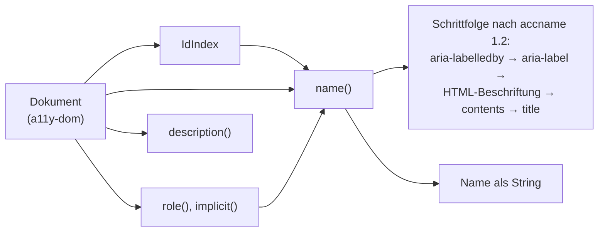

# accname

Accessible Name and Description Computation nach WAI-ARIA (accname 1.2) und
HTML-AAM, generisch über `a11y-dom`. Der Eingang für alles, was einen Namen
braucht.

## Stand

0.10.1 auf crates.io. Gegen Chrome differentiell geprüft: auditmysite hat dafür
`accname-diff`; am ersten Korpus stimmten 381 von 395 Namen überein, die
Abweichungen kamen sämtlich aus `contents` — dominante Ursache ist CSS
`text-transform`, das Chrome auf den Namen anwendet und `accname` nicht.

## Aufbau

## Öffentliche Fläche

| Eintrag | Zweck |
|---|---|
| `name`, `description` | die beiden Berechnungen |
| `role`, `implicit`, `allows_name_from_content`, `name_is_prohibited` | Rollenwissen, das die Schrittfolge braucht |
| `IdIndex` | Auflösung von `aria-labelledby`/`aria-describedby` ohne wiederholte Baumsuche |

## Abhängigkeiten

Nach unten: `a11y-dom`. Nach oben: `a11y-rules`, Hosts mit dokumentbasierter
Erhebung.

## Grenzen

Kein CSS: `text-transform`, `::before`/`::after` und Sichtbarkeitsregeln des
Browsers sind nicht abgebildet. Wo ein Host native Werte hat (Chrome über CDP),
sind diese getrennt zu kennzeichnen — nicht stillschweigend gegen die eigene
Berechnung zu tauschen.
