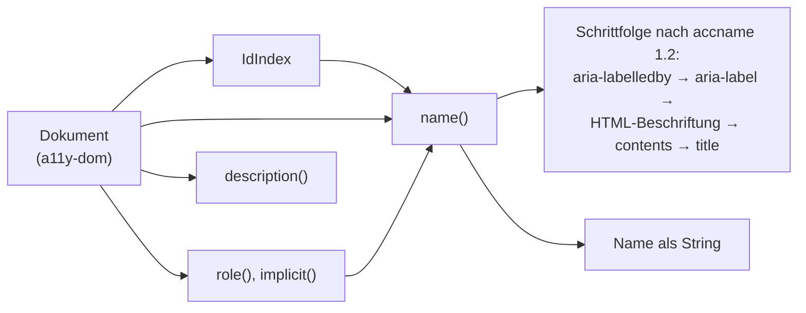

Accessible Name and Description Computation nach WAI-ARIA (accname 1.2) und
HTML-AAM, generisch über `a11y-dom`. Der Eingang für alles, was einen Namen
braucht.

## Stand

0.10.1 auf crates.io. Gegen Chrome differentiell geprüft: auditmysite hat dafür
`accname-diff`; am ersten Korpus stimmten 381 von 395 Namen überein, die
Abweichungen kamen sämtlich aus `contents` — dominante Ursache ist CSS
`text-transform`, das Chrome auf den Namen anwendet und `accname` nicht.

## Aufbau

```mermaid
flowchart LR
  doc["Dokument\n(a11y-dom)"] --> idx[IdIndex]
  idx --> nm["name()"]
  doc --> nm
  nm --> steps["Schrittfolge nach accname 1.2:\naria-labelledby → aria-label →\nHTML-Beschriftung → contents → title"]
  doc --> rl["role(), implicit()"]
  rl --> nm
  nm --> out["Name als String"]
  doc --> ds["description()"]
```

## Öffentliche Fläche

| Eintrag | Zweck |
|---|---|
| `name`, `description` | die beiden Berechnungen |
| `role`, `implicit`, `allows_name_from_content`, `name_is_prohibited` | Rollenwissen, das die Schrittfolge braucht |
| `IdIndex` | Auflösung von `aria-labelledby`/`aria-describedby` ohne wiederholte Baumsuche |

## Abhängigkeiten

Nach unten: `a11y-dom`. Nach oben: `a11y-rules`, Hosts mit dokumentbasierter
Erhebung.

## Grenzen

`name()` sieht kein CSS: `text-transform`, `::before`/`::after` und
Sichtbarkeitsregeln des Browsers sind nicht abgebildet. Zwischen den Teilen
eines Namens steht deshalb immer ein Leerzeichen, auch bei Inline-Elementen:
`<abbr>EU</abbr>-Arktis` ergibt „EU -Arktis", Chrome „EU-Arktis". Versteckt ist
nur, was `hidden` oder `aria-hidden="true"` trägt. Eine Entscheidung nach dem
Tag wurde in 0.11.1 versucht und in 0.11.2 zurückgenommen — auf echten Seiten
sind `` oft per CSS Block-Elemente (auditmysite-Korpus: 450 neue
Abweichungen gegen 5 behobene).

Hosts mit berechneten Stilen ([`Rendering`](a11y-dom.md), Tier 3) rufen
`name_rendered(doc, node, ids)`. Dort schließen Kinder mit `display: inline`
oder `contents` direkt an, alle anderen und ersetzte Elemente (`img`, `svg`, …)
werden abgesetzt, ` ` trennt immer; `display: none` (auch an einem
Vorfahren) und `visibility: hidden` blenden aus — auch ein so verstecktes
`<label>` benennt sein Feld nicht mehr —, außer bei ausdrücklichem
Verweis über `aria-labelledby`. Der Host muss die Leerraum-Textknoten mitliefern
— CDP `DOM.getDocument` lässt sie aus, `DOMSnapshot` nicht. Im
auditmysite-Korpus (35 Seiten) bleibt damit ein echtes Abweichungsmuster statt
sechs. `text-transform` und `::before`/`::after` bleiben auch dort außen vor.

`<dt>` (Rolle `term`) bekommt keinen Namen aus dem Inhalt: `term` steht weder
in ARIA 1.2 noch im ARIA-1.3-Entwurf unter „name from content", im Entwurf
ausdrücklich unter „name prohibited". Chrome benennt `<dt>` trotzdem aus dem
Inhalt — eine erwartete Abweichung. Wo ein Host native Werte hat (Chrome über CDP),
sind diese getrennt zu kennzeichnen — nicht stillschweigend gegen die eigene
Berechnung zu tauschen.
