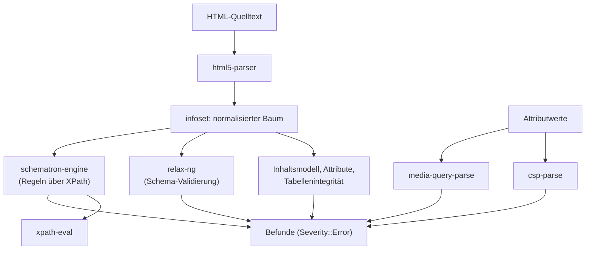

# html-conform

HTML5-Konformanzprüfung als Rust-Abhängigkeit, ohne JVM. Differentiell gegen
den Nu Html Checker (vnu) geprüft. Dazu gehören sechs eigenständige Pakete, die
die Syntax lesen, die die Prüfung braucht.

## Stand

0.2.1 auf crates.io, benutzt von auditmysite (`src/html_conform/`) und
astro-post-audit (`checks/html_validation.rs`). Auf `main` liegen Änderungen
nach 0.2.1: MSRV auf 1.88, zusätzliche Befunde (`img` ohne `alt`, interaktiver
Inhalt in `a`).

**Mit dem Umzug sind die `=`-Pins gefallen.** Vorher hing html-conform auf genaue
Versionen von vier seiner sechs Abhängigkeiten, weil jede Änderung eine
Release-Kaskade über sieben Repositories brauchte. Jetzt stehen sie als
Workspace-Abhängigkeiten mit `path` und `version` — eine Änderung, ein Release.

## Aufbau

| Paket | Rolle |
|---|---|
| `html5-parser` | WHATWG-Tokenizer und Tree-Construction, meldet Parse-Fehler mit Position |
| `csp-parse` | Content-Security-Policy nach CSP3-Grammatik |
| `media-query-parse` | Media Queries Level 4 |
| `xpath-eval` | XPath-Auswertung |
| `relax-ng` | RELAX NG, für die Schema-Seite der Prüfung |
| `schematron-engine` | Schematron-Regeln über `xpath-eval` |

## Öffentliche Fläche

`html_conform::check(html)` liefert die Befunde. Die sechs Pakete darunter haben
jeweils eine eigene, kleine API und lassen sich einzeln benutzen — `xpath-eval`
und `schematron-engine` zum Beispiel auch außerhalb von HTML.

## Abhängigkeiten

Nach unten: die sechs oben. Nach oben: auditmysite, astro-post-audit, künftig
`web-checks`.

## Grenzen

Kein vollständiger vnu-Ersatz. Die Prüfung ist differentiell gegen vnu
abgeglichen, nicht deckungsgleich; welche Klassen fehlen, steht in
`docs/html-conform/`. Und sie sagt nichts über Zugänglichkeit — Konformanz ist
eine andere Frage als Wahrnehmbarkeit.
