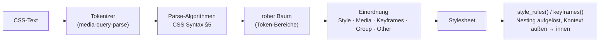

Liest rohen CSS-Text in Regeln, At-Regeln und Deklarationen und ebnet sie —
durch `@media`, Gruppenregeln und Verschachtelung hindurch — zu Stilregeln mit
aufgelösten Selektoren und ihrem Kontext ein. Es bewertet nichts: keine
Kaskade, kein Selektorabgleich, keine Auswertung von Media Queries.

## Stand

0.1.0, noch nicht veröffentlicht. Gedacht für `a11y-rules`, das
Stylesheet-Regeln prüft (`outline: none` an `:focus`,
`prefers-reduced-motion`, Media Queries zur Ausrichtung,
`text-align`/`line-height`). Die Hosts reichen den Text herein: auditmysite
aus den Stylesheets des Browsers, astro-post-audit aus `dist/*.css` und
`<style>`.

Geprüft an 337 echten Stylesheets von 48 Seiten (24 MB) sowie an Bootstrap
5.3.3 und Tailwind 2.2.19 (3,6 MB): kein Panic, rund 0,1 s je MB im
Release-Build.

## Aufbau

## Öffentliche Fläche

| Eintrag | Zweck |
|---|---|
| `parse_stylesheet` | Text → `Stylesheet`; scheitert nie |
| `Stylesheet`, `Rule` und die Regeltypen | der Baum, wie er in der Quelle steht |
| `Declaration` | Name (klein), Wert (serialisiert, ohne `!important`), `important` |
| `Stylesheet::style_rules` | jede Stilregel eingeebnet, als `Scoped` mit `Context` |
| `Stylesheet::keyframes` | jede `@keyframes`-Regel mit `Context` |

Verschachtelung: `&` am Selektoranfang wird durch den Elternselektor ersetzt
(bei mehreren durch `:is(a, b)`), an anderer Stelle durch `:is(eltern)`, ein
Selektor ohne `&` gilt als `& selektor`. Deklarationen direkt in einem
verschachtelten `@media` gelten dem Elternselektor.

## Abhängigkeiten

Nach unten: `media-query-parse` (nur dessen Tokenizer). Nach oben:
`a11y-rules` (geplant).

## Grenzen

- **Serialisiert, nicht original.** Werte und Selektoren entstehen neu aus den
  Token: Leerraum gefaltet, Kommentare weg, Zahlen kompakt (`.5` → `0.5`,
  `1.0` → `1`), Zeichenketten immer mit `"`. Erneut tokenisiert ergeben sie
  dieselben Token; die Einzelheiten stehen in der README des Pakets.
- **Keine Selektorprüfung.** Verworfen wird nur, worauf keine Grammatik passen
  kann: fehlerhafte Token, leere Einträge einer Selektorliste. Ob ein
  Selektor sonst gültig ist, entscheidet das Paket nicht.
- **Unbekannte At-Regeln** landen als `Other`; Regeln in ihrem Block fehlen —
  ein Browser wendet sie ebenfalls nicht an.
- **Grenzen gegen bösartige Eingaben:** Blöcke tiefer als 128 Ebenen fallen
  weg, ebenso aufgelöste Selektoren über 64 KiB.
