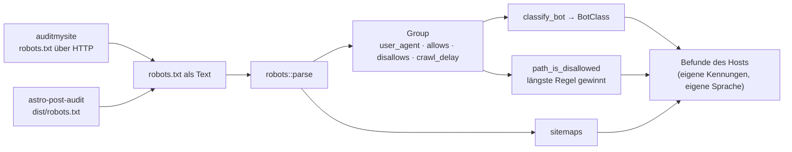

Die gemeinsame Auswertung zweier Auditoren, die dasselbe an derselben Seite
prüfen: auditmysite über eine laufende Seite in Chrome, astro-post-audit über
ein gebautes `dist/`. Verschieden ist die Erhebung, gleich ist die Auswertung.

## Stand

0.1.0, erste Familie: `robots`. Weitere folgen einzeln.

## Was das Paket nicht tut

- **Es holt nichts.** Kein HTTP, kein Dateisystem, kein Browser.
- **Es formuliert nichts.** Befundkennungen, Schweregrade und Texte bleiben beim
  Host; sie lauten dort verschieden und sind mehrsprachig. Hier stehen Daten und
  Prädikate.

Das zweite ist eine Entscheidung gegen den ersten Entwurf: gemeinsame
`Finding`-Rückgaben hätten erzwungen, die Kennungen beider Werkzeuge zu
vereinheitlichen. Das ist eine eigene, sichtbare Entscheidung — nicht der
Nebeneffekt eines Umzugs.

## Aufbau

## Was die Zusammenlegung aufgedeckt hat

Die beiden Werkzeuge widersprachen sich bei denselben Bots — an derselben Seite
hätten sie Gegenteiliges gemeldet:

| Bot | auditmysite | astro-post-audit | jetzt |
|---|---|---|---|
| GPTBot | Training | **Citation** | Training |
| ClaudeBot | Mixed | **Citation** | Mixed |
| anthropic-ai | Mixed | **Citation** | Mixed |

Maßgeblich ist, was die Anbieter selbst schreiben: OpenAI trennt `GPTBot`
(Training) von `OAI-SearchBot` (Suche), Anthropic `ClaudeBot` von
`Claude-SearchBot` und `Claude-User`. Die Suchvarianten fehlten in beiden
Registern und sind jetzt drin.

Das ist der Ertrag dieser Scheibe: nicht weniger Zeilen, sondern **eine**
Antwort statt zweier widersprüchlicher. Für astro-post-audit ändert sich damit
die Befundlage — „KI-Citation-Bot gesperrt" wird für GPTBot zu
„KI-Training-Bot gesperrt", was die übliche und unauffällige Lage ist.

## Öffentliche Fläche

| Eintrag | Zweck |
|---|---|
| `robots::parse` | Text → `RobotsTxt` mit Gruppen und Sitemaps |
| `RobotsTxt::wildcard_disallows_all`, `blocks`, `crawl_delays` | die Fragen, die beide Hosts stellen |
| `Group::disallows_path` | gilt eine Sperre für diesen Pfad |
| `classify_bot`, `BotClass` | Einordnung als Daten, ohne Wertung |
| `path_is_disallowed` | Längste-Regel-Auswertung mit `*` und `$` |

## Grenzen

Die Bot-Register sind eine Momentaufnahme: Anbieter benennen Crawler um und
fügen neue hinzu. Ein unbekannter Name ist `Unknown`, nicht „harmlos".

Die Pfadauswertung folgt Googles Auslegung (längere Regel gewinnt, bei
Gleichstand `Allow`). Andere Suchmaschinen legen die Spezifikation teils anders
aus; wer das genau braucht, prüft gegen das Ziel, nicht gegen dieses Paket.
