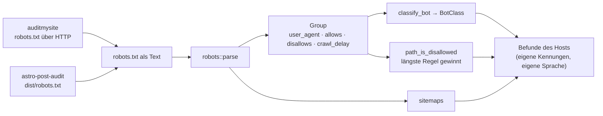

Die gemeinsame Auswertung zweier Auditoren, die dasselbe an derselben Seite
prüfen: auditmysite über eine laufende Seite in Chrome, astro-post-audit über
ein gebautes `dist/`. Verschieden ist die Erhebung, gleich ist die Auswertung.

## Stand

0.5.0, Familien `robots`, `meta`, `social`, `structured_data` und `hreflang`. Weitere folgen
einzeln; Render-blocking wurde geprüft und bleibt draußen (gemeinsam wären rund
fünf Zeilen, der Rest sind verschiedene Prüfungen).

## Was das Paket nicht tut

- **Es holt nichts.** Kein HTTP, kein Dateisystem, kein Browser.
- **Es formuliert nichts.** Befundkennungen, Schweregrade und Texte bleiben beim
  Host; sie lauten dort verschieden und sind mehrsprachig. Hier stehen Daten und
  Prädikate.

Das zweite ist eine Entscheidung gegen den ersten Entwurf: gemeinsame
`Finding`-Rückgaben hätten erzwungen, die Kennungen beider Werkzeuge zu
vereinheitlichen. Das ist eine eigene, sichtbare Entscheidung — nicht der
Nebeneffekt eines Umzugs.

## Aufbau

```mermaid
flowchart LR
  a["auditmysite\nrobots.txt über HTTP"] --> txt["robots.txt als Text"]
  b["astro-post-audit\ndist/robots.txt"] --> txt
  txt --> parse["robots::parse"]
  parse --> groups["Group\nuser_agent · allows · disallows · crawl_delay"]
  parse --> sm["sitemaps"]
  groups --> cls["classify_bot → BotClass"]
  groups --> pd["path_is_disallowed\nlängste Regel gewinnt"]
  cls & pd & sm --> host["Befunde des Hosts\n(eigene Kennungen, eigene Sprache)"]
```

## Was die Zusammenlegung aufgedeckt hat

Die beiden Werkzeuge widersprachen sich bei denselben Bots — an derselben Seite
hätten sie Gegenteiliges gemeldet:

| Bot | auditmysite | astro-post-audit | jetzt |
|---|---|---|---|
| GPTBot | Training | **Citation** | Training |
| ClaudeBot | Mixed | **Citation** | Mixed |
| anthropic-ai | Mixed | **Citation** | Mixed |

Maßgeblich ist, was die Anbieter selbst schreiben: OpenAI trennt `GPTBot`
(Training) von `OAI-SearchBot` (Suche), Anthropic `ClaudeBot` von
`Claude-SearchBot` und `Claude-User`. Die Suchvarianten fehlten in beiden
Registern und sind jetzt drin.

Das ist der Ertrag dieser Scheibe: nicht weniger Zeilen, sondern **eine**
Antwort statt zweier widersprüchlicher. Für astro-post-audit ändert sich damit
die Befundlage — „KI-Citation-Bot gesperrt" wird für GPTBot zu
„KI-Training-Bot gesperrt", was die übliche und unauffällige Lage ist.

### `meta` und `social` (0.3.0)

Titel- und Beschreibungslänge prüften beide Werkzeuge mit denselben Grenzen
(60 / 160) — und beide in **Bytes**: Ein Umlaut zählte doppelt, „Überschrift"
war früher zu lang als „Ueberschrift". `meta::length` zählt Zeichen nach
browserüblicher Leerraum-Zusammenfassung. Die Mindestlängen (30 / 120) gab es
nur in auditmysite; das Paket führt beide Grenzen, der Host entscheidet, welche
er meldet.

Bei OpenGraph galt ein Tag in auditmysite schon als vorhanden, wenn das Element
existierte, in astro-post-audit erst mit Inhalt. Jetzt einheitlich: leerer
Inhalt fehlt. Die Wertprüfungen aus astro-post-audit (`twitter:card` nur
`summary`, `summary_large_image`, `app`, `player`; `og:image` absolut) stehen
jetzt beiden zur Verfügung.

### `structured_data` (0.4.0)

Beide Werkzeuge werten JSON-LD aus, und ihre Tabellen widersprachen sich bei
fast jedem gemeinsamen Typ. Grundlage ist jetzt auditmysites Tabelle, weil sie
belegt ist: Jede Bewertung verweist auf die Seite von Google Search Central zum
Merkmal und trägt den Stand der Tabelle. Die Entscheidungen im Einzelnen:

| Punkt | astro-post-audit | auditmysite | jetzt |
|---|---|---|---|
| Anwesenheit | Schlüssel existiert | nicht leer | nicht leer (`""`, `null`, `[]`, `{}` fehlen) |
| `@context` | Teilzeichenkette `schema.org` | exakt, Listen, `@vocab`, Vererbung in `@graph` | exakt wie auditmysite; fehlend und fremd getrennt |
| Wurzel-Liste, `@type`-Liste | nicht aufgelöst, nur erster Typ | aufgelöst, alle Typen | aufgelöst, alle Typen |
| Organization, Person, WebSite | `name` (und `url`) Pflicht | nur Empfehlungen | nur Empfehlungen (so dokumentiert Google) |
| Article | `headline` Pflicht | nur Empfehlungen | nur Empfehlungen |
| NewsArticle `publisher` | Pflicht | — | empfohlen |
| WebSite `potentialAction` | niedrig | — | empfohlen; die Sitelinks-Suchbox gibt es seit 2024 nicht mehr, das Gewicht entscheidet der Host |
| LocalBusiness | `name` Pflicht | `name`, `address` Pflicht | `name`, `address` Pflicht |
| FAQPage | `acceptedAnswer` je Frage | nur `mainEntity` | beides |
| BreadcrumbList | `name` auch über `item.name` | ≥ 2 Einträge, `item` bis auf den letzten, `name` direkt | ≥ 2 Einträge, `item` bis auf den letzten, `name` auch über `item.name` |
| Doppelter `@type` über Blöcke | ja | nein | `duplicate_types`, der Host schaltet |
| Event, Recipe, VideoObject, JobPosting, SoftwareApplication, ProfilePage, CollectionPage, ItemList, Merchant Listing | — | ja | ja |

Zwei Dinge sind beim Umzug Daten geworden, die vorher Sätze waren: die Hinweise
zur Handprüfung (`ManualReview` statt englischer Sätze) und die Strukturprobleme
(`StructuralIssue` statt Meldungstext). Beschriftungen der Merkmale und
Statustexte bleiben beim Host.

Abgleich mit sichtbarem Inhalt (braucht die gerenderte Seite), Konsistenz über
alle Seiten eines Builds, Microdata und RDFa bleiben draußen.

### `hreflang` (0.5.0)

Beide Werkzeuge prüfen `x-default` und den Verweis auf die eigene Seite, nur
auditmysite den Sprachcode. Abgleich Fall für Fall:

| Punkt | astro-post-audit | auditmysite | jetzt |
|---|---|---|---|
| `x-default` vorhanden | exakt `x-default` | exakt `x-default` | ohne Rücksicht auf Schreibung |
| Verweis auf sich selbst | jeder Eintrag, auch `x-default`; Abfrage verworfen | jeder Eintrag, auch `x-default`; Abfrage bleibt | ohne `x-default` (Google: jede Sprachfassung nennt sich selbst); Abfrage bleibt, Fragment und Schrägstrich am Ende zählen nicht |
| Sprachcode | — | `xx`, `xxx`, `xx-YY` mit großer Region | Sprache, optional Schrift und Region, Schreibung beliebig (Googles Teilmenge von BCP 47) |
| Rückverweise zwischen Seiten | ja | — | bleibt beim Host |
| Ziel existiert im Build | ja | — | bleibt beim Host |

Was sich ändert: Die deutsche Startseite von heise.de nennt sich nur als
`x-default` und galt bei beiden als vollständig; jetzt fehlt ihr der Verweis
auf sich selbst. Fassungen, die sich nur in der Abfrage unterscheiden
(`?lang=de`), zählten bei astro-post-audit als Verweis aufeinander. auditmysite
hielt `de-de` und `zh-Hant` für ungültig. Die 23 Codes auf neun der 48
untersuchten echten Seiten sind nach alter und neuer Prüfung gültig.

## Öffentliche Fläche

| Eintrag | Zweck |
|---|---|
| `robots::parse` | Text → `RobotsTxt` mit Gruppen und Sitemaps |
| `RobotsTxt::wildcard_disallows_all`, `blocks`, `crawl_delays` | die Fragen, die beide Hosts stellen |
| `Group::disallows_path` | gilt eine Sperre für diesen Pfad |
| `classify_bot`, `BotClass` | Einordnung als Daten, ohne Wertung |
| `path_is_disallowed` | Längste-Regel-Auswertung mit `*` und `$` |
| `meta::length`, `LengthRange::classify`, `meta::TITLE`, `meta::DESCRIPTION` | Länge in Zeichen, Einordnung zu kurz / ok / zu lang |
| `social::is_present`, `is_complete`, `completeness` | Anwesenheit (leer = fehlt) und Vollständigkeit über `*_REQUIRED` / `*_FIELDS` |
| `social::is_valid_twitter_card`, `is_absolute_url` | Wertprüfungen |
| `structured_data::parse_blocks`, `parse_block` → `Block { nodes, issues, json_error }` | Script-Text → normalisierte Knoten und `StructuralIssue` |
| `structured_data::has_schema_org_context`, `extract_types`, `normalize_schema_type` | die Bausteine der Normalisierung |
| `structured_data::assess_node`, `SchemaRuleAssessment`, `ProductRuleContext` | Bewertung je Knoten und Typ: fehlende Pflicht- und Empfehlungspfade, Merkmal, Verfügbarkeit, Quelle |
| `structured_data::inventory_fields` | Felder je Typ für ein Inventar |
| `structured_data::duplicate_types` | `@type` in mehr als einem Block |
| `structured_data::RULESET_VERSION` | Stand der Regeltabelle |
| `hreflang::Alternate` | ein `link rel=alternate hreflang` mit vom Host aufgelöstem `href` |
| `hreflang::is_valid_code`, `invalid_codes`, `is_x_default`, `has_x_default` | Sprachcode und `x-default` |
| `hreflang::has_self_reference`, `same_page` | Verweis auf die eigene Seite, URL-Vergleich |

## Grenzen

Die Bot-Register sind eine Momentaufnahme: Anbieter benennen Crawler um und
fügen neue hinzu. Ein unbekannter Name ist `Unknown`, nicht „harmlos".

Die Pfadauswertung folgt Googles Auslegung (längere Regel gewinnt, bei
Gleichstand `Allow`). Andere Suchmaschinen legen die Spezifikation teils anders
aus; wer das genau braucht, prüft gegen das Ziel, nicht gegen dieses Paket.
