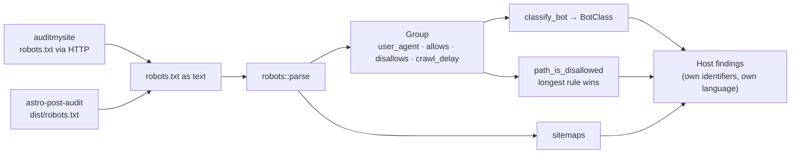

The shared evaluation of two auditors that check the same thing on the same page:
auditmysite via a live page in Chrome, astro-post-audit via a built
`dist/`. The collection differs, the evaluation is the same.

## Status

On [crates.io](https://crates.io/crates/web-checks), used by auditmysite and
astro-post-audit. Families `robots`, `meta`, `social`, `structured_data`, `hreflang` and
`third_party`. More follow individually; render-blocking was examined and stays out (shared, it would be about
five lines, the rest are different checks).

## What the package does not do

- **It fetches nothing.** No HTTP, no file system, no browser.
- **It words nothing.** Finding identifiers, severities and texts stay with the
  host; they differ there and are multilingual. What lives here is data and
  predicates.

The second is a decision against the first draft: shared
`Finding` return values would have forced unifying the identifiers of both tools.
That is a separate, visible decision — not the side effect of a move.

## Structure

```mermaid
flowchart LR
  a["auditmysite\nrobots.txt via HTTP"] --> txt["robots.txt as text"]
  b["astro-post-audit\ndist/robots.txt"] --> txt
  txt --> parse["robots::parse"]
  parse --> groups["Group\nuser_agent · allows · disallows · crawl_delay"]
  parse --> sm["sitemaps"]
  groups --> cls["classify_bot → BotClass"]
  groups --> pd["path_is_disallowed\nlongest rule wins"]
  cls & pd & sm --> host["Host findings\n(own identifiers, own language)"]
```

## What the merge uncovered

The two tools contradicted each other on the same bots — on the same page
they would have reported opposite things:

| Bot | auditmysite | astro-post-audit | now |
|---|---|---|---|
| GPTBot | Training | **Citation** | Training |
| ClaudeBot | Mixed | **Citation** | Training |
| anthropic-ai | Mixed | **Citation** | Mixed |

What counts is what the vendors themselves write: OpenAI separates `GPTBot`
(training) from `OAI-SearchBot` (search), Anthropic `ClaudeBot` from
`Claude-SearchBot` and `Claude-User`. The search variants were missing from both
registries and are now included.

Since 0.9.0 the registry follows the current operator documentation:
`ClaudeBot` counts as training, `Google-Extended` as mixed, `Applebot` and
`GoogleOther` as search engines. `Content-Signal:` lines are kept in
`RobotsTxt::content_signals`.

Since 0.10.0 `BotClass` separates a fetch triggered by a user's request
(`UserFetch`: `ChatGPT-User`, `Claude-User`, `Perplexity-User`, `DuckAssistBot`,
`MistralAI-User`) from AI search indexing (`AiCitation`), and web archives
(`ia_archiver`, `archive.org_bot`) get their own class `Archive`. Blocking a
bot is not all-or-nothing either: `block_scope` returns `None`, `Partial(paths)`
or `Full` for a group, with `Allow` exceptions resolved by RFC 9309 specificity,
and `RobotsTxt::effective_group(user_agent)` picks the group that actually applies
to a bot (most specific match, groups of the same agent merged, else `*`).

That is the yield of this slice: not fewer lines, but **one** answer
instead of two contradictory ones. For astro-post-audit the findings change
accordingly — "AI citation bot blocked" becomes, for GPTBot,
"AI training bot blocked", which is the usual and unremarkable situation.

### `meta` and `social` (0.3.0)

Both tools checked title and description length with the same limits
(60 / 160) — and both in **bytes**: an umlaut counted twice, "Überschrift"
was too long sooner than "Ueberschrift". `meta::length` counts characters after
browser-style whitespace collapsing. The minimum lengths (30 / 120) existed
only in auditmysite; the package carries both limits, the host decides which
it reports.

For OpenGraph, a tag counted as present in auditmysite as soon as the element
existed, in astro-post-audit only with content. Now uniform: empty
content counts as missing. The value checks from astro-post-audit (`twitter:card` only
`summary`, `summary_large_image`, `app`, `player`; `og:image` absolute) are
now available to both.

### `structured_data` (0.4.0)

Both tools evaluate JSON-LD, and their tables contradicted each other on
almost every shared type. The basis is now auditmysite's table, because it is
documented: every assessment references the Google Search Central page on the
feature and carries the table's version. The decisions in detail:

| Point | astro-post-audit | auditmysite | now |
|---|---|---|---|
| Presence | key exists | not empty | not empty (`""`, `null`, `[]`, `{}` count as missing) |
| `@context` | substring `schema.org` | exact, lists, `@vocab`, inheritance in `@graph` | exact like auditmysite; missing and foreign kept separate; under a foreign context only full schema.org IRIs count as a type (JSON-LD 1.1) |
| Root list, `@type` list | not resolved, only first type | resolved, all types | resolved, all types |
| Organization, Person, WebSite | `name` (and `url`) required | recommendations only | recommendations only (as Google documents it) |
| Article | `headline` required | recommendations only | recommendations only |
| NewsArticle `publisher` | required | — | recommended |
| WebSite `potentialAction` | low | — | not checked since 0.9.0 (sitelinks search box retired in 2024); `alternateName` is recommended instead (Google site names) |
| LocalBusiness | `name` required | `name`, `address` required | `name`, `address` required |
| FAQPage | `acceptedAnswer` per question | only `mainEntity` | both, plus `name` per question and `text` per answer (Google FAQ) |
| BreadcrumbList | `name` also via `item.name` | ≥ 2 entries, `item` except for the last, `name` directly | ≥ 2 entries, `item` except for the last, `name` also via `item.name` |
| Duplicate `@type` across blocks | yes | no | `duplicate_types`, the host switches it |
| Event, Recipe, VideoObject, JobPosting, SoftwareApplication, ProfilePage, CollectionPage, ItemList, Merchant Listing | — | yes | yes |

Since 0.10.0 the package carries an offline snapshot of the schema.org vocabulary
(`SCHEMA_ORG_VERSION`, currently 29.0): the type hierarchy (`is_known_type`,
`parent_types`, `is_subtype_of`), typo suggestions (`suggest_type`,
`suggest_property`) and `validate_vocabulary`, which reports unknown types and
properties, properties outside the domain of the type and values outside the range
as `VocabIssue`. `assess_node` uses the hierarchy: a subtype of `LocalBusiness`,
`WebPage`, `Organization` or `Article` is assessed with the rule of its parent
(a `Restaurant` like a `LocalBusiness`), the result keeps the concrete type.
`extract_entity_summary` condenses a node to `id`, `name`, `url`, `address` and `geo`
for checks across pages. Whether a finding results from this stays with the host.

Two things that used to be sentences became data in the move: the hints
for manual review (`ManualReview` instead of English sentences) and the structural problems
(`StructuralIssue` instead of message text). Labels of the features and
status texts stay with the host.

Comparison with visible content (needs the rendered page), consistency across
all pages of a build, Microdata and RDFa stay out.

Confirmed as intended (casoon/barrierlab#280): `parse_block` is the validity check for JSON-LD, including `@graph` containers without a top-level `@type`; only text that is not JSON is invalid.

### `hreflang` (0.5.0)

Both tools check `x-default` and the reference to the page itself, only
auditmysite the language code. Comparison case by case:

| Point | astro-post-audit | auditmysite | now |
|---|---|---|---|
| `x-default` present | exactly `x-default` | exactly `x-default` | regardless of capitalization |
| Reference to itself | every entry, also `x-default`; query discarded | every entry, also `x-default`; query kept | excluding `x-default` (Google: each language version names itself); query kept, fragment and trailing slash do not count |
| Language code | — | `xx`, `xxx`, `xx-YY` with uppercase region | language, optional script and region, any capitalization (Google's subset of BCP 47) |
| Return links between pages | yes | — | stays with the host |
| Target exists in the build | yes | — | stays with the host |

What changes: the German home page of heise.de names itself only as
`x-default` and counted as complete in both; now it lacks the reference
to itself. Versions that differ only in the query
(`?lang=de`) counted as references to each other in astro-post-audit. auditmysite
considered `de-de` and `zh-Hant` invalid. The 23 codes on nine of the 48
real pages examined are valid under both the old and the new check.

Confirmed as intended (casoon/barrierlab#280): `has_self_reference` ignores `x-default`, so a page that names itself only as `x-default` has no reference to itself.

### `render_blocking`

`is_blocking_script(type, async, defer)`: a classic script (no `type` or a JavaScript MIME type, any capitalization) without `async` and `defer`. `type="module"` is deferred like `defer` and never blocks, data blocks (`application/ld+json`, `importmap`, …) are not executed. `is_blocking_stylesheet_media(media)`: blocking for no, empty, `all` and `screen` media. The host collects the elements; wording and severity stay with the host.

## Public surface

| Entry | Purpose |
|---|---|
| `robots::parse` | text → `RobotsTxt` with groups and sitemaps |
| `RobotsTxt::wildcard_disallows_all`, `blocks`, `crawl_delays` | the questions both hosts ask |
| `Group::disallows_path` | does a block apply to this path |
| `RobotsTxt::effective_group`, `block_scope`, `Group::block_scope`, `BlockScope` | the group that applies to a bot and how far it blocks (none, partial, full) |
| `classify_bot`, `BotClass` | classification as data, without judgment |
| `path_is_disallowed` | longest-rule evaluation with `*` and `$` |
| `meta::length`, `LengthRange::classify`, `meta::TITLE`, `meta::DESCRIPTION` | length in characters, classification too short / ok / too long |
| `social::is_present`, `is_complete`, `completeness` | presence (empty = missing) and completeness via `*_REQUIRED` / `*_FIELDS` |
| `social::is_valid_twitter_card`, `is_absolute_url` | value checks |
| `structured_data::parse_blocks`, `parse_block` → `Block { nodes, issues, json_error }` | script text → normalized nodes and `StructuralIssue` |
| `render_blocking::is_blocking_script`, `is_blocking_stylesheet_media` | does a head script or stylesheet hold back rendering, from its attributes |
| `structured_data::has_schema_org_context`, `extract_types`, `normalize_schema_type` | the building blocks of normalization |
| `structured_data::assess_node`, `SchemaRuleAssessment`, `ProductRuleContext` | assessment per node and type: missing required and recommended paths, feature, availability, source |
| `structured_data::inventory_fields` | fields per type for an inventory |
| `structured_data::duplicate_types` | `@type` in more than one block |
| `structured_data::RULESET_VERSION` | version of the rule table |
| `structured_data::is_known_type`, `parent_types`, `is_subtype_of`, `SCHEMA_ORG_VERSION` | bundled schema.org vocabulary: type exists, direct parents, ancestry |
| `structured_data::validate_vocabulary` → `VocabIssue`, `suggest_type`, `suggest_property` | unknown type or property, wrong domain, wrong range, with a suggestion |
| `structured_data::extract_entity_summary` → `EntitySummary` | `id`, `name`, `url`, `address`, `geo` of a node for checks across pages |
| `hreflang::Alternate` | a `link rel=alternate hreflang` with an `href` resolved by the host |
| `hreflang::is_valid_code`, `invalid_codes`, `is_x_default`, `has_x_default` | language code and `x-default` |
| `hreflang::has_self_reference`, `same_page` | reference to the page itself, URL comparison |
| `third_party::classify_host`, `classify_url` | host or URL → `Match { provider, category }`; the URL form applies path rules (`facebook.net` serves both the Like plugin and the ad pixel) |
| `third_party::classify_storage_name` | cookie or web-storage name → provider (exact or prefix, case-sensitive) |
| `third_party::host_of` | host of an absolute or scheme-relative URL; credentials, port and trailing dot stripped |
| `third_party::PROVIDERS`, `RULESET_VERSION` | the provider list, every entry with a `source`; version of the list |

## Limits

The provider list is a documented snapshot, not a census. An unknown host is
`None`; absence from the list says nothing about a host. The seat is the
provider's own statement and says nothing about where data actually flows.
Whether a provider may load before consent is a legal question the package
does not answer.

The bot registries are a snapshot: vendors rename crawlers and
add new ones. An unknown name is `Unknown`, not "harmless".

Path evaluation follows Google's interpretation (longer rule wins, on a
tie `Allow`). Other search engines interpret the specification differently in places;
anyone who needs that precisely checks against the target, not against this package.
